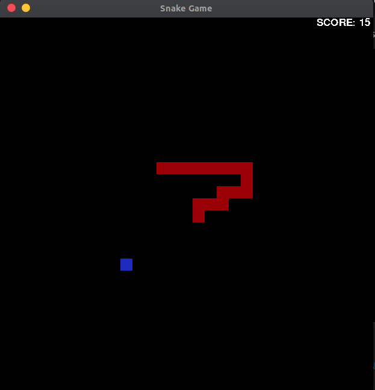

# A Simple Snake game made with python and Pygame

I made a snake game in python and used algorithmic techniques to efficiently control the snake's movement and resize/grow its body.

Prerequisites: You need to have Pygame installed on you computer to run/test the game. To install Pygame, open up your terminal(or Command Prompt if you are on Windows) and type:

```
    pip install Pygame
```

Screenshot:



I hope you like it!


